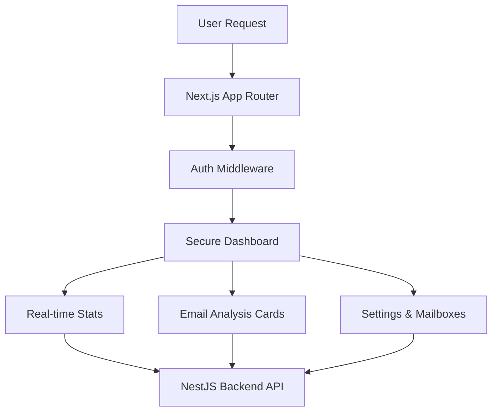

## 🛡️ Deep Analysis: Security Visualization

The SecureMail Frontend is a **Cinematic Security Operations Center (SOC)** for end-users, designed to make complex security data intuitive and actionable.

### 🎨 Design Philosophy: Cinematic SOC
We utilize **Framer Motion** and **Tailwind CSS 4** to create a "Living UI" that pulses with service health and animates the lifecycle of email threats. 



### 🔍 Key Dashboards
- **Mailbox Explorer**: A high-speed interface for viewing emails with real-time security score overlays.
- **Threat Simulation**: Cinematic animations that visualize the "Decision Path" (Pipeline) taken for a specific email.
- **Service Intel**: A dynamic status board showing the health of the entire gRPC microservice ecosystem.

### 🛠️ Tech Stack
- **Framework**: Next.js 16 (App Router)
- **Runtime**: React 19 (Server Components)
- **Styling**: Tailwind CSS v4 + Lucide Icons
- **Animation**: Framer Motion
- **Data Fetching**: React Query v5

---

### 1. Via Turborepo (Root)
```bash
npm run dev:ui
```

### 2. Manual Execution
1. **Setup**:
   ```bash
   npm install
   ```
2. **Environment**: Ensure `.env.local` points to the Backend:
   `NEXT_PUBLIC_API_URL=http://localhost:3000`
3. **Run**:
   ```bash
   npm run dev
   ```

---

## 🛠️ Features
- **Modern UI**: Built with Tailwind CSS and Framer Motion.
- **Microservice Integration**: Communicates with the NestJS backend on port 3000.
